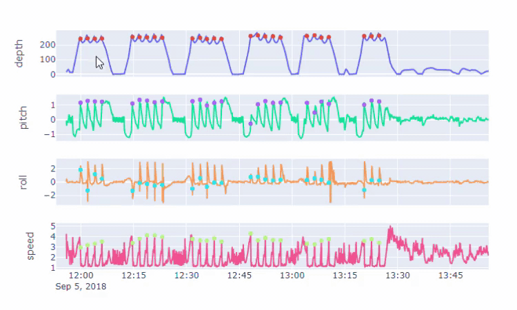
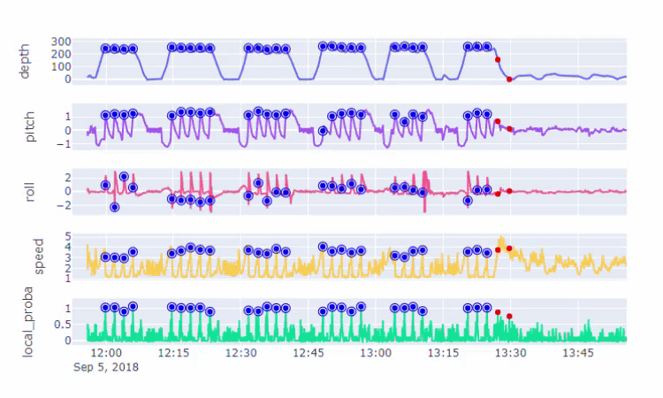

# `stickleback`

> A machine learning pipeline for detecting fine-scale behavioral events in bio-logging data.

## Installation

Install from GitHub using pip.

```pip3 install git+git://www.github.com/FlukeAndFeather/stickleback.git```

## Key concepts

* Behavioral events are brief behaviors that can be represented as a point in time, e.g. feeding or social interactions.
* High-resolution bio-logging data (e.g. from accelerometers and magnetometers) are multi-variate time series. Traditional classifiers struggle with time series data.
* `stickleback` takes a time series classification approach to detect behavioral events in longitudinal bio-logging data.

## Quick start

### Load sample data

The included sensor data contains the depth, pitch, roll, and speed of six blue whales at 10 Hz, and the event data contains the times of lunge-feeding behaviors.


```python
import pandas as pd
import sktime.classification.interval_based
import sktime.classification.compose
from stickleback.stickleback import Stickleback
import stickleback.data
import stickleback.util
import stickleback.visualize

# Load sample data
sensors, events = stickleback.data.load_lunges()

# Split into test and train (3 deployments each)
def split_dict(d, ks):
    dict1 = {k: v for k, v in d.items() if k in ks}
    dict2 = {k: v for k, v in d.items() if k not in ks}
    return dict1, dict2

test_deployids = list(sensors.keys())[0:2]
sensors_test, sensors_train = split_dict(sensors, test_deployids)
events_test, events_train = split_dict(events, test_deployids)
```

### Visualize sensor and event data

`plot_sensors_events()` produces an interactive figure for exploring bio-logger data.


```python
# Choose one deployment to visualize
deployid = list(sensors.keys())[0]
stickleback.visualize.plot_sensors_events(deployid, sensors, events)
```



### Define model

Initialize a `Stickleback` model using Supervised Time Series Forests and a 10 s window.


```python
# Supervised Time Series Forests ensembled across the columns of `sensors`
cols = sensors[list(sensors.keys())[0]].columns
tsc = sktime.classification.interval_based.SupervisedTimeSeriesForest(n_estimators=2)
stsf = sktime.classification.compose.ColumnEnsembleClassifier(
    estimators = [('STSF_{}'.format(col),
                   tsc,
                   [i])
                  for i, col in enumerate(cols)]
)

sb = Stickleback(
    local_clf=stsf,
    win_size=50,
    tol=pd.Timedelta("5s"),
    nth=10,
    n_folds=4
)
```

### Fit model

Fit the `Stickleback` object to the training data.


```python
sb.fit(sensors_train, events_train)
```

### Test model

Use the fitted `Stickleback` model to predict occurence of lunge-feeding events in the test dataset.


```python
predictions = sb.predict(sensors_test)
```

### Assess results

Use the temporal tolerance (in this example, 5 s) to assess model predictions. Visualize with an outcome table and an interactive visualization. In the figure, blue = true positive, hollow red = false negative, and solid red = false positive.


```python
outcomes = sb.assess(predictions, events_test)
stickleback.visualize.outcome_table(outcomes, sensors_test)
```


<div>
<style scoped>
    .dataframe tbody tr th:only-of-type {
        vertical-align: middle;
    }

    .dataframe tbody tr th {
        vertical-align: top;
    }

    .dataframe thead th {
        text-align: right;
    }
</style>
<table border="1" class="dataframe">
  <thead>
    <tr style="text-align: right;">
      <th></th>
      <th>F1</th>
      <th>TP</th>
      <th>FP</th>
      <th>FN</th>
      <th>Duration (hours)</th>
    </tr>
    <tr>
      <th>deployid</th>
      <th></th>
      <th></th>
      <th></th>
      <th></th>
      <th></th>
    </tr>
  </thead>
  <tbody>
    <tr>
      <th>bw180905-49</th>
      <td>0.966292</td>
      <td>43</td>
      <td>2</td>
      <td>1</td>
      <td>1.999972</td>
    </tr>
    <tr>
      <th>bw180905-53</th>
      <td>0.943396</td>
      <td>25</td>
      <td>2</td>
      <td>1</td>
      <td>1.999972</td>
    </tr>
  </tbody>
</table>
</div>


```python
deployid = list(events_test.keys())[0]
stickleback.visualize.plot_predictions(deployid, 
                                       sensors_test, 
                                       predictions, 
                                       outcomes)
```


